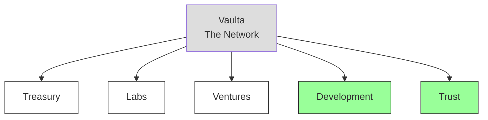
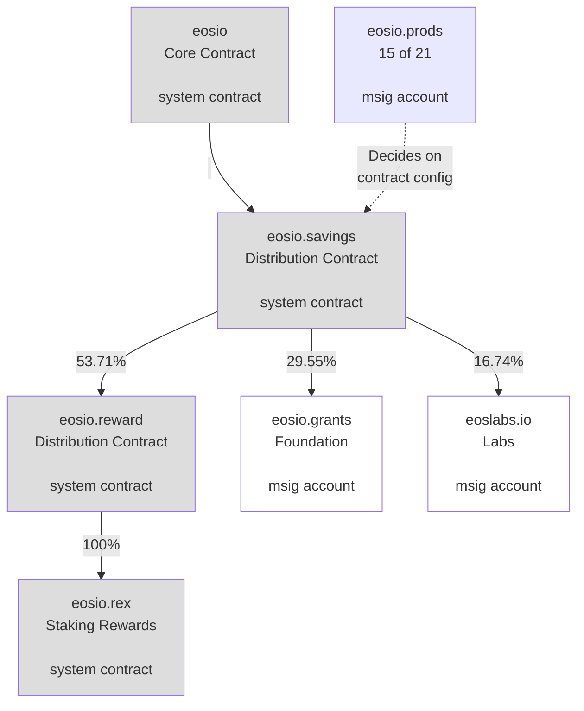
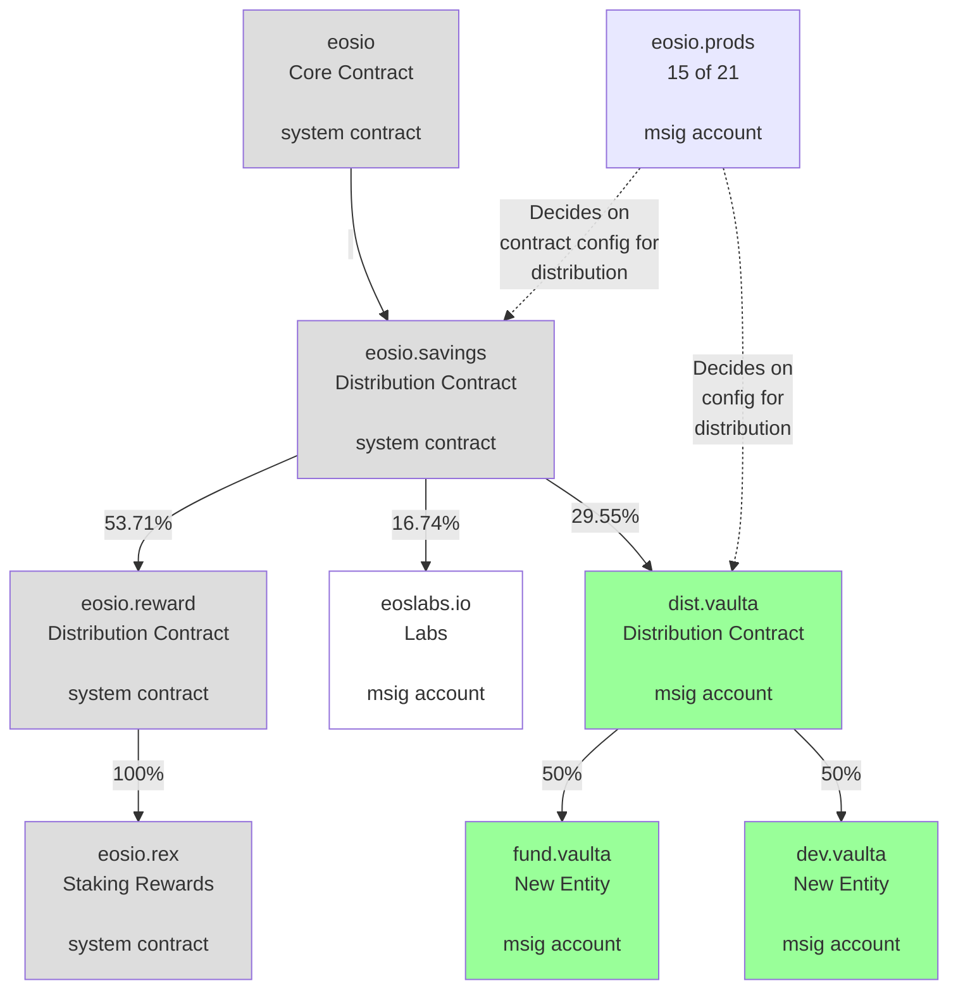

# Stage 1: Vaulta Foundation Transition

> This proposal creates two new legal entities to ensure continuity after the Vaulta Foundation shuts down.

## Summary

1. Proposal Overview  
2. Create 2 new legal entities:  
   1. [Vaulta Network Trust (VNT)](#vaulta-network-trust-vnt)  
   2. [Vaulta Development Team (VDT)](#vaulta-development-team-vdt)  
3. Propose and Approve 2 MSIG Proposals  
   1. [Proposal 1: Account Creation](#proposal-1-account-creation)  
   2. [Proposal 2: Contracts and Configuration](#proposal-2-contracts-and-configuration)

### Changes between v5 and v6

1. Added a note to the [overview](#overview) that this is only Stage 1.  
2. Changed [dev.vaulta](#devvaulta) allocation to 50% from dist.vaulta  
3. New [fund.vaulta](#fundvaulta) account for unallocated 50% from dist.vaulta  
4. Increased permissions size on [dev.vaulta](#devvaulta) msig  
5. [VDT Leadership](#vdt-leadership) explicitly names Areg as leader  
6. Note on [VDT Permissions](#vdt-permissions) being made final before 2nd msig  
7. Note on [VNT Transition Team](#vnt-transition-team) being made final before 2nd msig  
8. A note added to [VNT Scope](#vnt-scope) further defining what this organization will not do.  

---

## Overview

This document describes Stage 1 of the transition process for the Vaulta Network. The Vaulta Foundation is shutting down. This proposal creates two new entities to ensure continuity of critical staff and assets.

The two new entities are:
- **Vaulta Development Team (VDT)**: A for-profit corporation for software development
- **Vaulta Network Trust (VNT)**: A non-profit organization for asset custody

This is only the first stage. More changes will be required for the Vaulta Network to succeed.

Off-chain work has begun to start these entities. However, funding is required to begin operations. The on-chain work includes:
- Creating new accounts
- Deploying a new distribution contract
- Configuring the distribution system

This proposal also addresses two Foundation accounts that are now inaccessible.

Network consensus on this proposal is critical. It signals the network's direction and begins the handoff from the Vaulta Foundation to the new entities.

## New Legal Entities

This diagram shows the organizations that operate on behalf of the network. White boxes represent existing entities. Green boxes represent new entities.

## Vaulta Development Team (VDT)

The Vaulta Development Team (VDT) will be an independent organization. It will develop and maintain the open source software for the Vaulta Network. The VDT leadership will coordinate with Block Producers to ensure alignment and transparency.

The Vaulta Network will fund the VDT through existing mechanisms. These are the same mechanisms previously used by the Vaulta Foundation.

### Funding Flow

A new intermediate step will be added to the existing [eosio.saving](#eosiosaving-config) process:

1. Funds flow to [dist.vaulta](#distvaulta) account
2. 50% flows to [dev.vaulta](#devvaulta) account for VDT access
3. 50% flows to [fund.vaulta](#fundvaulta) account (unallocated)

The [dev.vaulta](#devvaulta) account is owned by the Block Producers. The development team can access it when required. Only then do funds leave network control and go to the development team.

### Legal Structure

The VDT will be a for-profit U.S. corporation. This reduces operational complexity. The VDT will prioritize contributions to open source projects owned by the Vaulta Network Trust.

Code ownership is organized this way to prevent future organizational changes from impacting developer contributions.

### VDT Leadership

Areg will lead the core development team through this new entity. The team composition is still being finalized. It is expected to have around 5 members initially.

This proposal delegates development team management to Areg and the team he chooses.

### VDT Distribution

The VDT will receive 50% of the distribution through the [dev.vaulta](#devvaulta) account from the [dist.vaulta](#distvaulta) account.

The remaining 50% will go to the [fund.vaulta](#fundvaulta) account. This account is owned by the Block Producers (15/21 signature threshold).

This amount should be enough to fund the core development team and its operations.

### VDT Permissions

The [dev.vaulta](#devvaulta) account permissions are managed by a multisig permission. This multisig is controlled by VDT members with additional backup signers selected by VDT leadership.

The final configuration will be confirmed after participants agree to this role.

**Note**: The dev.vaulta account permission will be updated in the 2nd msig proposal as needed.

### VDT Immediate Priorities

The first goals for this leadership team are already in progress:

- Work with legal, accounting, and other professionals to establish the corporation
- Determine minimal organization structure and hire critical staff and developers
- Perform administrative work to begin operations
- Evaluate the state of the Vaulta Network to decide the technology roadmap

Communication and collaboration with willing Block Producers and leaders of other Vaulta-based organizations is required throughout this process.

## Vaulta Network Trust (VNT)

The Vaulta Network Trust (VNT) will be a new independent non-profit organization. It will provide permanent operational functions for the network. It will hold off-chain shared assets.

The Vaulta Network cannot be a legal owner because it is not a legal entity. The VNT will own assets on behalf of the network.

The VNT mission is to ensure continuity of these assets as different organizations rise and fall over time. The VNT must remain minimal in size. It must remain without influence despite controlling these assets.

### VNT Transition Team

This msig proposal delegates responsibility to select people. They will form a transition team. The transition team will research and bootstrap this entity on behalf of the network.

The group will work to achieve a sensible structure in terms of cost and governance. The transition team will be disbanded after the VNT is created and an initial board of directors is in place.

**Note**: The transition team will be defined and included in the final version of this document and msig before the 2nd msig is proposed for approval.

### VNT Transition Team: Immediate Priorities

Network leadership will identify individuals or entities capable of leading the creation of this entity. This will include:

- Research the best region to incorporate and legal structure
- Identify a sufficient number of board members and recruit them to the future VNT board
- Present the network leadership with a researched plan for approval using a symbolic msig
- Create the legal entity and coordinate the transfer of assets from the Foundation
- Reach consensus with the Block Producers on the members of the first Board of Directors

### VNT Scope

Once established, the VNT will be the custodian of the following for the Vaulta Network:

- The remaining off-chain financial assets held specifically by the Vaulta Foundation
- The Vaulta brand and intellectual property related to the Vaulta Network
- Ownership of required services for operations (Github, Google Workspace, Domains, etc)

The VNT Transition Team will work with the Vaulta Foundation as it shuts down. This will ensure a smooth transition. The transition will take an undetermined amount of time.

**Note**: This organization is NOT responsible for network activities like marketing or communications. This organization is exclusively responsible for off-chain asset management.

### VNT Board of Directors

The organization will be managed by a group of known individuals. These individuals must have a vested interest in securing the network and its assets.

The initial VNT leadership will depend on the structure of the entity. The transition team will determine this.

Ideal candidates for potential board members include:

- Representatives of network-funded organizations
- Block Producers

The board can be changed at any time through network consensus. The transition team will explore whether this can be enforced through the organization's bylaws or through existing board members. If possible, this will be implemented.

### VNT Funding

This organization should have as low a budget as possible.

Initial funding can come directly from leftover off-chain assets held by the outgoing Foundation during the handoff.

After the budget is determined, the VNT should budget for a 5-10 year minimal runway. Any excesses should be reported to the Block Producers for determination of their purpose.

---

## MSIG Stages

Two msig proposals must be approved in sequential order to reconfigure the network for this proposal.

Additional technical information for each proposal is available using the Github links.

## Proposal 1: Account Creation

The first proposal creates the 2 accounts required for this proposal. This must happen before deploying the smart contract and setting the distribution configuration.

**Proposal**

- Status: https://unicove.com/en/vaulta/msig/aaron/fwmpntxlmfhz
- Actions: https://unicove.com/en/vaulta/msig/aaron/fwmpntxlmfhz/actions
- Transaction: https://unicove.com/en/vaulta/msig/aaron/fwmpntxlmfhz/transaction

**Source Code + Documentation**

- https://github.com/greymass/msigs/tree/dev/proposals/dev.accounts

### New Account Details

The following new accounts will be created.

#### dev.vaulta

This account is similar to eosio.grants previously used by the Vaulta Foundation. This account is owned by the network. The Block Producers have granted access to it for the [Vaulta Development Team](#vaulta-development-team-vdt). It will be used to claim and access funding through the [dist.vaulta](#distvaulta) distribution contract.

**Permissions**:
- owner: eosio@active (owned by the network)
- active: Areg + Aaron
  - **Note**: will be replaced in 2nd msig with [VDT Permissions](#vdt-permissions)

#### dist.vaulta

This is a secondary distribution contract owned by the network and managed by the Block Producers. The code for this contract is identical to eosio.saving.

**Permissions**:
- owner: eosio@active (owned by the network)
- active: eosio@active (owned by the network)
- devclaim: account-based permission to allow calling upstream eosio.saving::claim action

This contract can claim tokens upstream from the eosio.saving account. Those tokens are then distributed based on this contract's configuration. See [eosio.saving config](#eosiosaving-config) for additional details.

## Proposal 2: Contracts and Configuration

The second proposal configures the distribution contracts and resolves outstanding issues with Vaulta Foundation accounts.

**Proposal**

- Not available yet

**Source Code + Documentation**

- https://github.com/greymass/msigs/tree/dev/proposals/coredevdist

### Messaging

This msig will contain specific messaging to associate it with the text of this document. It will likely be either a hash or a link to a specifically versioned document. This represents the direction that the network has reached consensus on.

This messaging will be done through a minimal token transfer. The memo field will contain the message.

### Distribution Contract

A smart contract will be set on the dist.vaulta account. This contract is identical to the eosio.saving contract. The hash will be identical, but the configuration will be different.

This proposal will call:
- eosio::setcode to set the contract code
- eosio::setabi to set the contract ABI

Once the contract is set, the setdistrib action will be called to distribute funds:
- 50% to dev.vaulta account
- 50% to fund.vaulta account

### New Account Details

The following new account will be created.

#### fund.vaulta

This account can claim the 50% unallocated distribution from the dist.vaulta account. This is an administrative account. It is needed due to how the dist.vaulta contract works.

**Permissions**:
- owner: eosio@active (owned by the network)
- active: eosio@active

### eosio.saving config

The eosio.saving contract configuration must change. The eosio.grants account will be replaced with the dist.vaulta account.

#### Current config

The flow chart below shows how the eosio.saving contract is currently configured.

#### Updated config

The diagram below shows how these contracts will be changed. New elements are highlighted in green. The eosio.grants account has been removed from the diagram.

### Updating permissions

Two accounts have been identified as unusable based on their permissions. Each account exists in a 2-of-2 multisig between the Foundation and Labs. The Foundation is shutting down. These accounts cannot be used until the Block Producers (the owner of both accounts) take action.

Listed below are the actions to remove the Foundation from these permissions.

#### eosio.mware

Links: [Account](https://unicove.com/en/vaulta/account/eosio.mware) | [Permissions](https://unicove.com/en/vaulta/account/eosio.mware/permissions) | [Balances](https://unicove.com/en/vaulta/account/eosio.mware/balances)

This account holds the remaining budget allocated to Middleware. Labs has indicated they would agree with assigning this account to the development team.

Account overview:
- Owner: eosio@active (owned by the network)
- Active: 2-of-2 msig between Foundation and Labs
- 10 million EOS allocated to Middleware, but not released

This proposal would change the active permission to be controlled by the Block Producers (15/21).

#### fund.wram

Links: [Account](https://unicove.com/en/vaulta/account/fund.wram) | [Permissions](https://unicove.com/en/vaulta/account/fund.wram/permissions) | [Balances](https://unicove.com/en/vaulta/account/fund.wram/balances)

This account was used to accumulate RAM for the network as part of the tokenomics proposal. It currently holds a significant amount of RAM. The RAM cannot be accessed with its current permissions.

Account overview:
- Owner: eosio@active (owned by the network)
- Active: 2-of-2 msig between Foundation and Labs
- Approx 42GB RAM (45,181,397.077 KB) from tokenomics plan

This proposal would change the active permission to be controlled by the Block Producers (15/21).
